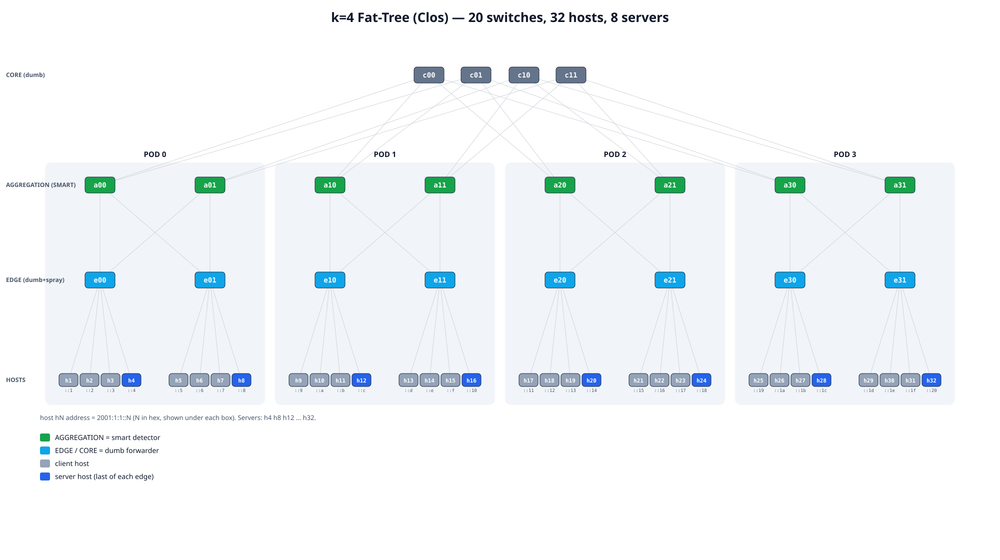

# Distributed In-Network SYN-Flood Detection on a Fat-Tree

A P4/BMv2 testbed that detects and blocks TCP SYN-flood DDoS **inside a
datacenter fabric**, where no single switch ever sees a whole flow. The edge
switches spray packets per-packet across their uplinks, so a connection's SYNs
and ACKs take different paths up and are seen by different aggregation switches.
Each aggregation switch runs a lightweight Count-Min-Sketch detector; a central
controller reconstructs each flow across detectors, scores it, and blocks
attackers fabric-wide.

<p align="center">
  
</p>

## Topology (k = 4 fat-tree)

| Tier | Count | Role |
|------|-------|------|
| Core | 4 (`c00 c01 c10 c11`) | dumb down-forwarder |
| Aggregation | 8 (`a00 … a31`) | **smart CMS detector** |
| Edge | 8 (`e00 … e31`) | dumb forwarder + **per-packet uplink spray** |
| Hosts | 32 (4 per edge) | 8 servers + 24 clients |

- **Servers** = the last host of each edge: `h4 h8 h12 h16 h20 h24 h28 h32`
  (one per edge). Every other host is a client.
- Addressing: `hN = 2001:1:1::N` (N in hex). IPv6 throughout.
- 64 links. Down-routing is fixed by destination; **up-routing is a free
  choice**, and the edge sprays it — that spray is the only thing that makes a
  flow asymmetric across the fabric, which is exactly the case a distributed
  detector must handle.

## Why it's hard (the crux)

Real routing keeps a connection's 5-tuple together, so one switch sees both the
SYN and the ACK. Per-packet spray breaks that: `a00` might see the SYNs while
`a13` sees the completing ACKs. A per-switch "SYNs without ACKs" heuristic then
false-alarms on healthy traffic. The controller solves this by keying flows on
`(src, dst, dport, proto)` and **summing evidence across all detectors** before
it decides.

## Detection pipeline

1. **Data plane (`p4src/ddos_detector.p4`, on the 8 aggregations).** A Count-Min
   Sketch counts SYNs per flow key. Every 32 SYNs it fires a `THRESHOLD` digest;
   ACKs for flows it never saw a SYN for fire an `EVIDENCE` digest.
2. **Controller (`controller.py`).** Reconstructs each flow, computes **windowed**
   features (SYN Δ from the CMS snapshot, ACKs since last window, completion
   ratio, SYN rate, duration) and scores them with a lean RandomForest
   (`models/lean_model.pkl`).
3. **Reputation / hysteresis.** A per-flow score (+1 benign window, −1 attack
   window, cap +3) blocks a source only at score ≤ −2 — so one RTT-lagged benign
   window never blocks, but a real attacker (every window bad) is blocked after a
   couple of windows, on **every** detector at once.

## Validated results (k=4 fat-tree)

| Scenario | Traffic | Outcome |
|----------|---------|---------|
| `attack` | scapy SYN flood, all clients | **8/8 attackers blocked** |
| `benign` | steady `ab`, all clients | 0 false positives |
| `flash`  | heavy `ab` burst, all clients | 0 false positives (score absorbs spray lag) |
| `mixed`  | half flood + half benign | attackers blocked, benign served, 0 FP |
| `lrddos` | pps ladder 1…100 | detected down to the lowest rate |

Verified server-side from pcaps: attackers blocked, benign requests served,
attack SYNs leaked only in the pre-block window.

## Layout

```
my2/
├── network.py            boot fabric, auto-config hosts (IPv6+NDP), start 8 servers
├── controller.py         forwarding on all 20 + detection on the 8 aggregations
├── server.py             per-server nginx + pcap (auto-started by network.py)
├── launch.py             traffic from all clients: benign/flash/attack/mixed/lrddos
├── models/               lean_model.pkl, lean_feature_order.pkl
├── p4src/                ft_core.p4, ft_edge.p4, ddos_detector.p4
├── lib/                  fattree.py (topology) · attack.py · verify.py · nginx_ft.conf
├── fattree_topology.svg  diagram above
└── RUNBOOK.md            step-by-step run guide
```

## Quick start

```bash
sudo apt install -y nginx apache2-utils        # one-time

# terminal A — fabric + servers
cd /home/ayush/my2 && sudo python3 network.py

# terminal B — controller
cd /home/ayush/my2 && python3 controller.py

# in the mininet prompt (set MODE in launch.py first)
mininet> py exec(open('launch.py').read())

# score the run
python3 /home/ayush/my2/lib/verify.py
```

See **RUNBOOK.md** for the full walkthrough (live server logs, resets, caveats).

## Known limitation

A stealth flood that completes ≥10% of its handshakes evades a completion-ratio
detector by design — its ratio overlaps the RTT-lagged benign region, so no
threshold separates them without new false positives. Catching it needs an
orthogonal signal (short-window SYN volume / destination entropy), left as
future work.
